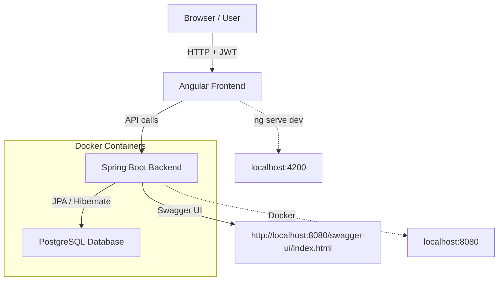
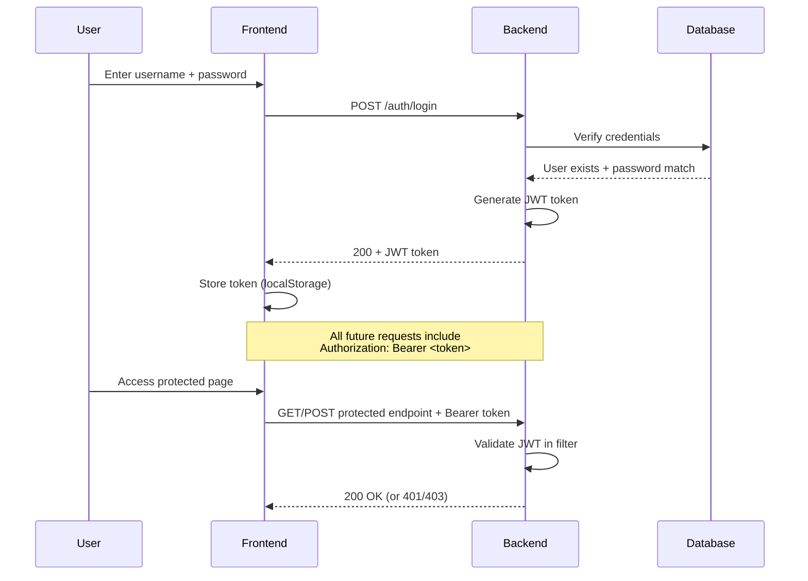
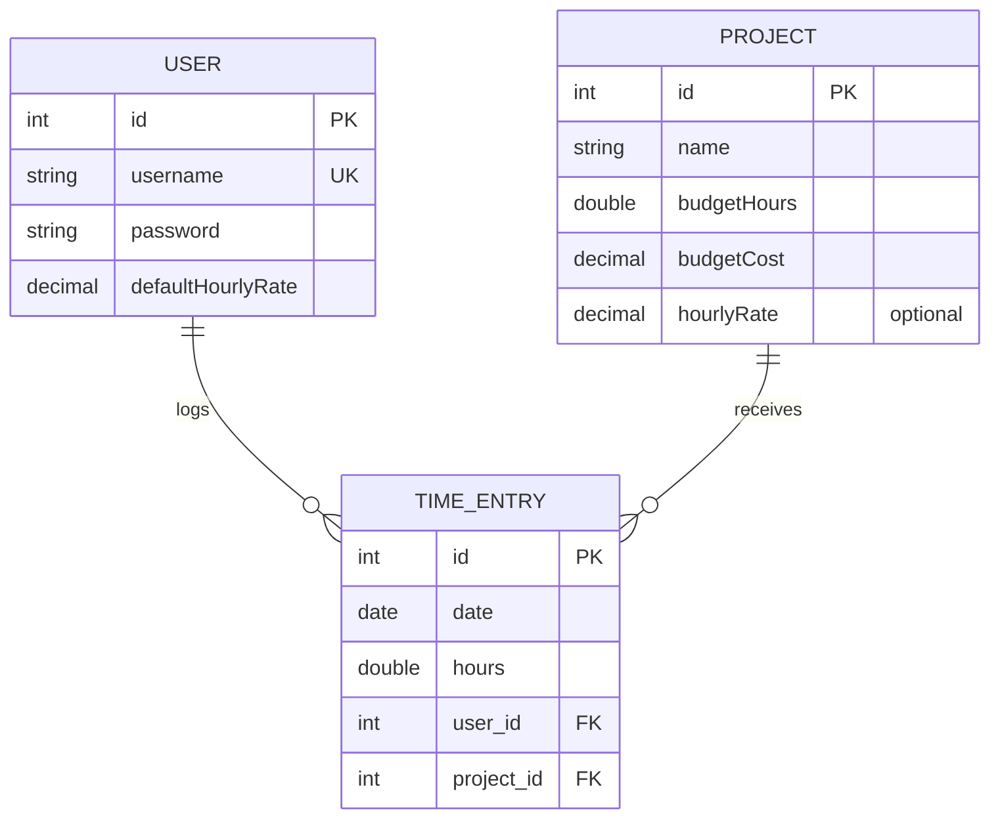

# Time Tracker Application

A full-stack browser-based time tracking application that allows users to assign daily working hours to different projects. The application includes a frontend (Angular SPA), a backend (Spring Boot REST API), and a PostgreSQL database for persistent storage.

## Features

- User registration and JWT-based authentication
- Project management with configurable budgets (hours and cost) and hourly rates
- Daily time entry logging with required fields (date, project, hours)
- Automatic cost calculation: `hours × (project's hourly rate if defined, otherwise the user's default hourly rate)`, technically this mean: `hours * (project.hourlyRate != null ? project.hourlyRate : user.defaultHourlyRate)`
- Budget validation on time entry creation/update (returns 400 if exceeded)
- Weekly overview: total hours per day
- Monthly overview: total hours per month
- RESTful API with Spring Data REST auto-generated endpoints + custom overviews
- Interactive API documentation & testing via Swagger UI
- Containerized deployment with Docker & Docker Compose

## Technologies

**Backend**
- Java 21
- Spring Boot 3.3.x
- Spring Data REST (auto-exposes repositories as REST endpoints)
- Spring Data JPA + Hibernate
- Spring Security + JWT (custom filter)
- PostgreSQL
- springdoc-openapi (Swagger UI)
- Gradle (build tool)

**Frontend**
- Angular 18 (standalone components, signals, RxJS)
- Tailwind CSS
- FormsModule for two-way binding
- Nginx (production serve)

**Infrastructure**
- Docker + Docker Compose (database, backend, frontend)
- Persistent PostgreSQL volume

**Data Model Overview**

| Entity        | Key Fields                                      | Relationships / Notes |
|---------------|-------------------------------------------------|-----------------------|
| **User**      | id (PK), username (unique), password (BCrypt hashed), defaultHourlyRate | OneToMany TimeEntry. Implements UserDetails for security. |
| **Project**   | id (PK), name, budgetHours, budgetCost, hourlyRate (optional) | OneToMany TimeEntry. Rate fallback to user default. |
| **TimeEntry** | id (PK), date (LocalDate), hours (double), user (FK), project (FK) | ManyToOne User & Project. Budget checks on save. |

- **Cost calculation**: `hours × (project.hourlyRate ?? user.defaultHourlyRate)`
- **Budget enforcement**: On TimeEntry save, sum all entries for the project → if sum(hours) > budgetHours **or** sum(costs) > budgetCost → 400 Bad Request

## 1. How to Start from Scratch

### Prerequisites

- Docker & Docker Compose
- Git
- Node.js 20+ & npm (for frontend development)
- Java 21 JDK (optional for local backend dev)

### Clone & Run

```bash
# 1. Clone the repository
cloen this repository and cd into it
cd timetracker

# 2. Build backend JAR
cd backend
./gradlew clean build
cd ..

# 3. Build frontend
cd frontend
ng build --configuration production

# 4. Start database + backend + fronfend (recommended)
docker compose up --build

# Wait for everything to startup

# 5. Open Swagger UI (API documentation & testing)
# → open http://localhost:8080/swagger-ui/index.html for bachend open-api ui
# → open http://localhost:4200 for ui
```


### Stop and reset
```bash
# Stop containers
docker compose down

# Wipe database (delete all data – optional)
docker compose down -v
docker compose up --build
```

# Test Scenarios & API Documentation

## 2. Test Scenarios with Swagger UI

All examples use Swagger UI:\
http://localhost:8080/swagger-ui/index.html

### Swagger Groups

-   Use the **"public"** group for authentication endpoints
-   Use the **"protected"** group for all other endpoints

### Authentication for Protected Requests

1.  POST /auth/login → copy token\
2.  Click green **Authorize** button (top right)\
3.  Paste: `Bearer <token>` (with space after Bearer)\
4.  Click **Authorize** → close popup

------------------------------------------------------------------------

## Use Case: User Authentication

### Scenario 1: Register New User

**Endpoint:** POST /auth/register (public group)

**Body:**

``` json
{
  "username": "alice",
  "password": "alice123",
  "defaultHourlyRate": 45
}
```

**Expected:**\
200 OK → user object with id (e.g. 1) and hashed password

**Explanation:**\
Creates a new user account. Password is automatically hashed.

------------------------------------------------------------------------

### Scenario 2: Login and Get JWT Token

**Endpoint:** POST /auth/login (public group)

**Body:**

``` json
{
  "username": "alice",
  "password": "alice123"
}
```

**Expected:**\
200 OK → plain JWT token string (copy it)

**Explanation:**\
Authenticates user and returns JWT for subsequent requests.

------------------------------------------------------------------------

### Scenario 3: Invalid Login (Wrong Password)

**Endpoint:** POST /auth/login

**Body:**

``` json
{
  "username": "alice",
  "password": "wrongpass"
}
```

**Expected:**\
403 Forbidden or 401 Unauthorized

**Explanation:**\
Tests authentication failure.

------------------------------------------------------------------------

## Use Case: Project & Cost Management

### Scenario 4: Create a Project

**Endpoint:** POST /api/projects (protected group)

**Body:**

``` json
{
  "name": "Website Redesign 2026",
  "budgetHours": 80,
  "budgetCost": 3600,
  "hourlyRate": 45
}
```

**Expected:**\
201 Created or 200 OK → project object with new id (e.g. 1)

**Explanation:**\
Creates a project with time & cost budgets and optional hourly rate.

------------------------------------------------------------------------

## Use Case: Daily Time Tracking

### Scenario 5: Log Valid Time Entry

**Endpoint:** POST /api/time-entries (protected)

**Body:**

``` json
{
  "project": {
    "id": 1
  },
  "date": "2026-02-18",
  "hours": 7.5
}
```

**Expected:**\
201 Created or 200 OK → time entry saved

**Explanation:**\
Logs hours against a project.\
Costs = 7.5 × 45 = 337.5\
Total hours = 7.5 \< 80 budget → success.

------------------------------------------------------------------------

### Scenario 6: Log Time Entry Exceeding Budget

**Endpoint:** POST /api/time-entries (protected)

**Body (repeat until total hours \> 80, or costs \> 3600):**

``` json
{
  "project": {
    "id": 1
  },
  "date": "2026-02-19",
  "hours": 90
}
```

**Expected:**\
400 Bad Request → error message like\
"Project hours budget exceeded"\
or\
"Project cost budget exceeded"

**Explanation:**\
Tests automatic budget validation on save.

------------------------------------------------------------------------

## Use Case: Weekly and Monthly Overview

### Scenario 7: Weekly Overview

**Endpoint:** GET /api/overviews/weekly (protected)

**Parameters:** - userId: 1 (or your user id from register) - start:
2026-02-16 (week start date)

**Expected:**\
200 OK

**Example Response:**

``` json
{
  "2026-02-18": 7.5
}
```

**Explanation:**\
Displays total hours per day for the specified week.

------------------------------------------------------------------------

### Scenario 8: Monthly Overview

**Endpoint:** GET /api/overviews/monthly (protected)

**Parameters:** - userId: 1 - year: 2026 - month: 2

**Expected:**\
200 OK → total hours for the month (e.g. 7.5)

**Explanation:**\
Summary of recorded hours for the entire month.

------------------------------------------------------------------------

## Additional Test Scenarios

### Scenario 9: Get All Projects

**Endpoint:** GET /api/projects (protected)

**Expected:**\
200 OK → list of all projects

------------------------------------------------------------------------

### Scenario 10: Get Time Entries in Date Range (Search)

**Endpoint:**\
GET /api/time-entries/search/findByUserIdAndDateBetween (protected)

**Parameters:** - userId: 1 - start: 2026-02-01 - end: 2026-02-28

**Expected:**\
200 OK → list of time entries in date range

**Explanation:**\
Tests custom query method exposed by Spring Data REST.

------------------------------------------------------------------------

## 3. Data Model Overview

See the table in the Technologies section above.

### Business Logic

**Cost calculation:**\
hours × (project.hourlyRate ?? user.defaultHourlyRate)

**Budget enforcement:**\
On TimeEntry save: - Sum all entries for the project\
- If exceeded → throw exception\
- Return 400 Bad Request

**Persistence:**\
PostgreSQL with auto-schema updates (ddl-auto: update)

**Authentication:**\
JWT Bearer tokens, stateless session management

**API Style:**\
Combination of Spring Data REST (auto-CRUD) + custom controllers for
overviews & auth

------------------------------------------------------------------------

### System Architecture Overview




### Authentication Flow (JWT)



### Entity-Relationship Diagram




## Final Notes

Enjoy tracking time!

Open issues for bugs or feature requests.\
Feel free to contribute PRs.


